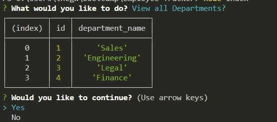

# Employee Tracker
  # Table of Contents
1. [License](#license)
2. [Description](#description)
3. [Installation](#installation)
4. [Usage](#usage)
5. [Contributing](#contributing)
6. [Tests](#tests)
7. [Questions](#questions)
  ## license
  
  MIT
  ## description
# USER STORY

AS A business owner
I WANT to be able to view and manage the departments, roles, and employees in my company
SO THAT I can organize and plan my business

## ACCEPTANCE CRITERIA

GIVEN a command-line application that accepts user input
WHEN I start the application
THEN I am presented with the following options: view all departments, view all roles, view all employees, add a department, add a role, add an employee, and update an employee role
WHEN I choose to view all departments
THEN I am presented with a formatted table showing department names and department ids
WHEN I choose to view all roles
THEN I am presented with the job title, role id, the department that role belongs to, and the salary for that role
WHEN I choose to view all employees
THEN I am presented with a formatted table showing employee data, including employee ids, first names, last names, job titles, departments, salaries, and managers that the employees report to
WHEN I choose to add a department
THEN I am prompted to enter the name of the department and that department is added to the database
WHEN I choose to add a role
THEN I am prompted to enter the name, salary, and department for the role and that role is added to the database
WHEN I choose to add an employee
THEN I am prompted to enter the employee’s first name, last name, role, and manager, and that employee is added to the database
WHEN I choose to update an employee role
THEN I am prompted to select an employee to update and their new role and this information is updated in the database 

  ## installation
  N/A
  ## usage
  Clone the code from the github repo, run the app in an integrated Terminal and answer the questions.
  ## contributing
  I am the sole contributor
  ## tests
  n/a
  ## questions
  "Below is listed my contact information and github profile if you have further questions."

  [Willisson7 on GitHub](https://github.com/Willisson7)
  
  thegwillis@gmail.com
